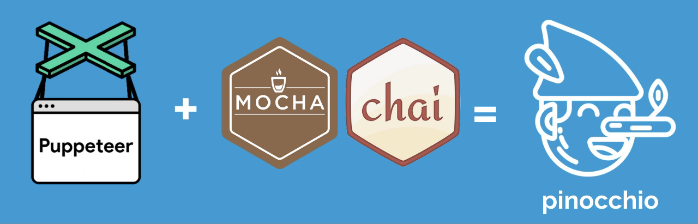
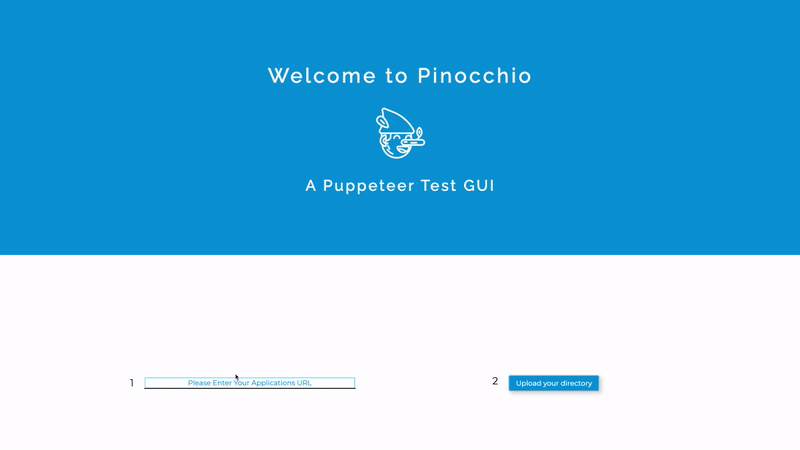
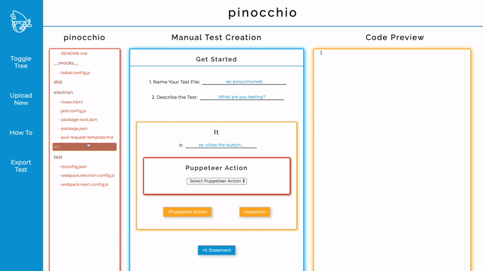
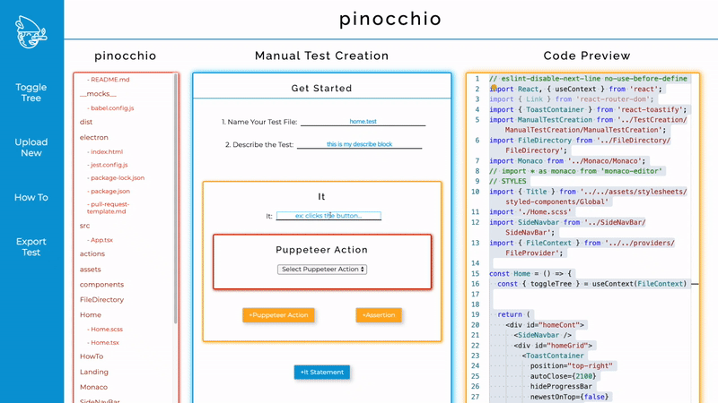

# pinocchio

<h1 align="center">
    <strong>
     
    
     
     
    Pinocchio
     
    </strong>
</h1>

<h2 align="center"> Pinocchio is an Electron powered GUI for Puppeteer test generation with Mocha and Chai. It allows users to identify selectors for tests and preview code in the provided code editor. Once the tests have been created, an exportation of the test suites into the user's application is only a button click away.
</h2>
 

 
 
For developers who are interested in using Google's powerful Puppeteer Node library specifically for testing purposes, they may have to initially spend some time parsing through the plethora of functionalities Puppeteer provides in order to identify which methods are most relevant to their testing goals.

 
 

Pinocchio minimizes Puppeteer onboarding labor and isolates specific Puppeteer methods that are often used in testing in conjunction with Mocha and Chai. The result is a more seamless transition that allows users to dive right into these technologies, saving developers precious time and energy.
 
 
As a fresh beta product, Pinocchio was developed for the open source community with the tech accelerator [OSLabs](https://opensourcelabs.io/).

# Installation
To get started, 

1) Download the app from our [website](https://pinocchio.dev).

2) Install Puppeteer, Mocha, and Chai.
<h3 align="center"><code>npm install puppeteer mocha chai</code></h3>

3) Now, let's generate some tests!

## <b> How to use </b>

1) From the landing page, the user will be able to input their application's URL and upload their app code base.

2. Upon upload, the user will be able to  
- reference directories and files directly in the app itself using the file tree and code preview section powered by Monaco Editor and  
- use the Pinocchio test generation GUI to generate test code without having to touch any code editor.

3. Users have the option of generating one Describe block that wraps their test and are able to generate as many It statements as needed.

4. Each It statement will correspond with any of the Puppeteer actions that the user selects as well as one Assertion block.

5. When ready, simply click on "Export Test" in the navigation bar. That's it!

# Tech Stack
Javascript, React (Context, Hooks, Router, Toastify), Express, Webpack, Electron, Typescript, HTML/CSS/SASS, Monaco Editor, Node.js, Jest, Enzyme, Styled-Components

# Read more
[Medium](https://medium.com/pinocchio-for-developers/play-with-pinocchio-a-puppeteer-test-generation-gui-8a9f9f501a7a)

# Contact Us
pinocchiodevs@gmail.com 
[LinkedIn](https://www.linkedin.com/company/pinocchio-dev)

We encourage and appreciate any feedback, suggestions, and stars if you feel so inclined!
<b><h3>Co-Creators:</h3></b>
- **Adam Joesten** - [@AdamJoesten](https://github.com/AdamJoesten)  | [LinkedIn](https://www.linkedin.com/in/adamjoesten/)
- **Brandi Richardson** - [@bjr2008](https://github.com/bjr2008)| [LinkedIn](https://www.linkedin.com/in/brandi-richardson-28295158/)
- **Giao ("Yao") Tran** - [@gd-tran](https://github.com/gd-tran)| [LinkedIn](https://www.linkedin.com/in/giao-tran-91353654/)
- **Harlan Evans** - [@harlanevans](https://github.com/harlanevans)| [LinkedIn](https://www.linkedin.com/in/harlan-evans/)
- **Lex Choi** - [@lexiphur](https://github.com/lexiphur)| [LinkedIn](https://www.linkedin.com/in/lexchoi3/)
